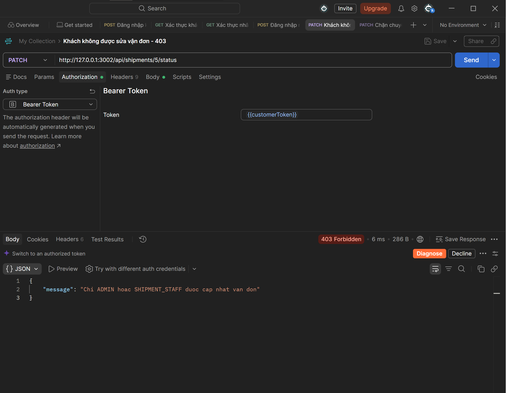
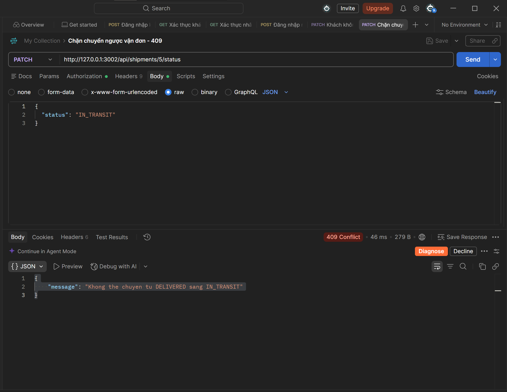

# Ecommerce Microservices MVP

Backend thương mại điện tử sử dụng Node.js, REST, gRPC và Kafka.

## Kiến trúc

| Thành phần | Chức năng | Database |
|---|---|---|
| API Gateway | REST, xác thực, phân quyền, cache, giới hạn request | Redis |
| Auth Service | Đăng ký, đăng nhập, JWT | PostgreSQL |
| Customer Service | Hồ sơ khách hàng, membership | PostgreSQL |
| Product Service | Sản phẩm, giữ hàng, hoàn hàng | MongoDB |
| Order Service | Đơn hàng, giảm giá, transactional outbox | PostgreSQL |
| Shipment Service | Nhận OrderCreated và quản lý vận đơn | MongoDB |

Gateway gọi các service qua gRPC.

Outbox worker gửi sự kiện OrderCreated sang Kafka.
Shipment nhận sự kiện và tự tạo vận đơn.

Provisioning worker tạo hồ sơ Customer cho tài khoản mới.
Hồ sơ mặc định có membership STANDARD, score 10.

## Cấu trúc

- api-gateway/: ứng dụng REST Gateway.
- services/: mã nguồn 5 service và các worker.
- proto/: định nghĩa giao tiếp gRPC.
- database/: schema và seed PostgreSQL.
- Dockerfile: Dockerfile chung, chọn ứng dụng qua APP_PATH.
- compose.yaml: cấu hình toàn bộ hệ thống.
- .env.example: cấu hình mẫu.

## Yêu cầu

- Docker Desktop đang chạy, sử dụng Linux containers.
- Docker Compose v2.
- Node.js và npm nếu phát triển trực tiếp trên máy.
- Các lệnh bên dưới dùng PowerShell tại thư mục gốc dự án.

## Chạy lần đầu trên máy mới

Tạo file cấu hình:

```powershell
Copy-Item .env.example .env
```

Nếu đã có .env, giữ file hiện tại.

Tạo JWT secret khi .env chưa có secret.
Lệnh này cần Node.js và ghi lại file .env:

```powershell
$secret = node -e "console.log(require('node:crypto').randomBytes(48).toString('hex'))"
"AUTH_JWT_SECRET=$secret" | Set-Content -Encoding ascii .env
```

Khởi động:

```powershell
docker compose up -d --build
```

PostgreSQL tự chạy schema và seed khi volume mới được khởi tạo.
MongoDB được các service tạo collection và index lúc khởi động.
Kafka-init tạo topic OrderCreated.

Môi trường mới chưa có tài khoản và sản phẩm demo.

## Khởi động lại môi trường đã có

```powershell
docker compose up -d
```

Không cần chạy npm start khi hệ thống đang chạy bằng Docker.

## Kiểm tra hệ thống

```powershell
docker compose ps -a
```

```powershell
Invoke-RestMethod `
    -Uri "http://127.0.0.1:3002/api/health" `
    -TimeoutSec 20 |
    ConvertTo-Json -Depth 5
```

Kết quả bình thường:

- Gateway và 5 service: healthy.
- Database, Redis, Kafka: healthy.
- Hai worker: Up.
- Kafka-init: Exited (0).
- API health: status UP.

Xem log:

```powershell
docker compose logs --tail 50 api-gateway
docker compose logs --tail 50 order-service outbox-worker
docker compose logs --tail 50 shipment-service provisioning-worker
```

## Dừng hệ thống

```powershell
docker compose stop
```

Hoặc xóa container và network, giữ named volume:

```powershell
docker compose down
```

Không dùng docker compose down -v nếu cần giữ dữ liệu.

## Cập nhật code trong Docker

Ví dụ cập nhật Gateway:

```powershell
docker compose build api-gateway
docker compose up -d --no-deps api-gateway
```

Order và outbox worker dùng chung image:

```powershell
docker compose build order-service
docker compose up -d --no-deps order-service outbox-worker
```

Auth và provisioning worker dùng chung image:

```powershell
docker compose build auth-service
docker compose up -d --no-deps auth-service provisioning-worker
```

## Tài khoản demo trên môi trường đã thực hành

| Username | Password | Role |
|---|---|---|
| customer_demo | Demo@123456 | CUSTOMER |
| admin_demo | Admin@123456 | ADMIN |
| shipment_demo | Shipment@123456 | SHIPMENT_STAFF |

Đây là tài khoản phát triển, không dùng cho triển khai công khai.
Các tài khoản này không được tự seed trên máy mới.

## Đăng ký và đăng nhập

Đăng ký:

```powershell
$baseUrl = "http://127.0.0.1:3002"

$body = @{
    username = "demo_new"
    password = "Demo@123456"
    email = "demo_new@example.com"
} | ConvertTo-Json

Invoke-RestMethod `
    -Uri "$baseUrl/api/auth/register" `
    -Method Post `
    -ContentType "application/json" `
    -Body $body
```

Đăng nhập:

```powershell
$body = @{
    username = "demo_new"
    password = "Demo@123456"
} | ConvertTo-Json

$login = Invoke-RestMethod `
    -Uri "$baseUrl/api/auth/login" `
    -Method Post `
    -ContentType "application/json" `
    -Body $body

$headers = @{
    Authorization = "Bearer $($login.accessToken)"
}

$me = Invoke-RestMethod `
    -Uri "$baseUrl/api/auth/me" `
    -Headers $headers

$me
```

Xem Customer:

```powershell
Invoke-RestMethod `
    -Uri "$baseUrl/api/customers/$($me.uid)" `
    -Headers $headers
```

Hồ sơ được tạo bất đồng bộ, có thể cần chờ vài giây.
Tên ban đầu là username; membership STANDARD, score 10.

## Cấp quyền trên môi trường mới

Sau khi đăng ký tài khoản mong muốn, quản trị viên database cấp role.

Ví dụ cấp ADMIN cho demo_new:

```powershell
docker compose exec -T auth-db psql -U auth_user -d auth_db -c "UPDATE users SET roleid = (SELECT roleid FROM roles WHERE rolename = 'ADMIN') WHERE username = 'demo_new';"
```

Sau khi đổi role, đăng nhập lại để lấy JWT mới.
Không cho phép người dùng tự chọn role trong API đăng ký.

## API chính

Các API nghiệp vụ yêu cầu header Authorization: Bearer <token>.

| Method | Endpoint | Quyền |
|---|---|---|
| POST | /api/auth/register | Công khai |
| POST | /api/auth/login | Công khai |
| GET | /api/auth/me | Đã đăng nhập |
| GET | /api/health | Công khai |
| GET | /api/customers/:uid | Chính chủ hoặc ADMIN |
| PUT | /api/customers/:uid | Chính chủ hoặc ADMIN; chỉ ADMIN đổi mid |
| GET | /api/products | Đã đăng nhập |
| GET | /api/products/:pid | Đã đăng nhập |
| POST | /api/products | ADMIN |
| PUT | /api/products/:pid | ADMIN |
| DELETE | /api/products/:pid | ADMIN |
| POST | /api/orders | Tạo đơn cho UID trong JWT |
| GET | /api/orders | Đơn của mình; ADMIN có thể lọc uid |
| GET | /api/orders/:oid | Chính chủ hoặc ADMIN |
| GET | /api/orders/:oid/shipment | Chính chủ, ADMIN hoặc SHIPMENT_STAFF |
| GET | /api/shipments | Của mình; ADMIN/SHIPMENT_STAFF xem toàn bộ |
| GET | /api/shipments/:sid | Chính chủ, ADMIN hoặc SHIPMENT_STAFF |
| PATCH | /api/shipments/:sid/status | ADMIN hoặc SHIPMENT_STAFF |

## Tạo sản phẩm trên môi trường mới

Đăng nhập ADMIN và đặt Bearer token vào $adminHeaders, rồi chạy:

```powershell
$productBody = @{
    pname = "Chuot khong day"
    price = "250000"
    quantity = 50
} | ConvertTo-Json

$product = Invoke-RestMethod `
    -Uri "$baseUrl/api/products" `
    -Method Post `
    -Headers $adminHeaders `
    -ContentType "application/json" `
    -Body $productBody

$product
```

Dùng PID từ kết quả trả về khi tạo đơn.

## Tạo đơn hàng

Mỗi yêu cầu mới dùng một UUID trong header Idempotency-Key.
Khi thử lại cùng yêu cầu, giữ nguyên UUID và nội dung.

```powershell
$requestId = [guid]::NewGuid().ToString()

$orderHeaders = @{
    Authorization = $headers.Authorization
    "Idempotency-Key" = $requestId
}

$orderBody = @{
    items = @(
        @{ pid = 1; qty = 1 }
    )
} | ConvertTo-Json -Depth 5

$order = Invoke-RestMethod `
    -Uri "$baseUrl/api/orders" `
    -Method Post `
    -Headers $orderHeaders `
    -ContentType "application/json" `
    -Body $orderBody `
    -TimeoutSec 70

$order | ConvertTo-Json -Depth 5
```

PID 1 phải tồn tại và đủ hàng.
Lệnh này tạo đơn thật và trừ kho.

Giảm giá:

- score 10 tương ứng giảm 10%.
- discount lưu số tiền giảm.
- total_amount lưu số tiền sau giảm.
- Đơn đã hoàn tất giữ nguyên giá và mức giảm đã lưu.

Ví dụ: mua 1 sản phẩm giá 250000 với score 10:
discount = 25000.00, total_amount = 225000.00.

## Xem vận đơn tự tạo

```powershell
Invoke-RestMethod `
    -Uri "$baseUrl/api/orders/$($order.oid)/shipment" `
    -Headers $headers |
    ConvertTo-Json -Depth 5
```

Kafka xử lý bất đồng bộ; nếu chưa có vận đơn, chờ rồi đọc lại.

Trạng thái:

- PENDING → IN_TRANSIT → DELIVERED.
- PENDING → CANCELLED.
- Không chuyển ngược từ DELIVERED.

CANCELLED hiện chỉ đổi trạng thái vận đơn,
chưa hủy đơn hàng hoặc hoàn kho.

## Tính nhất quán dữ liệu

- Giữ kho và ghi lịch sử giữ hàng trong một cập nhật MongoDB.
- Gửi lại mã giữ hàng không trừ kho thêm.
- Gửi lại mã hoàn hàng không cộng kho thêm.
- Order lưu tiến trình để phục hồi lượt tạo đơn bị bỏ dở.
- Đơn, chi tiết và sự kiện outbox được lưu cùng transaction.
- Worker chỉ đánh dấu published_at sau khi Kafka xác nhận.
- Kafka có thể nhận sự kiện trùng khi thử lại.
- Shipment dùng unique index oid và event_id để tránh vận đơn trùng.

## Redis

- Giới hạn 60 request/phút/IP, trừ endpoint health.
- Cache danh sách sản phẩm trong 5 giây.
- Header X-Cache cho biết HIT hoặc MISS.
- Thao tác quản lý sản phẩm đổi phiên bản cache.
- Thay đổi kho qua Order có thể chậm hiển thị tối đa 5 giây.
- Tạo đơn vẫn kiểm tra kho trực tiếp tại Product Service.

## Các giới hạn hiện tại

- Lịch sử giữ hàng nằm trong document sản phẩm và chưa có cơ chế lưu trữ lâu dài.
- Sản phẩm có lịch sử giữ hàng bị chặn xóa.
- Lượt giữ hàng của đơn đã hoàn tất chưa có trạng thái kết thúc riêng.
- Sự kiện Kafka sai định dạng chưa được chuyển sang dead-letter topic.
- Provisioning worker thử lại task lỗi; chưa có hàng đợi riêng cho lỗi vĩnh viễn.
- Cảnh báo TimeoutNegativeWarning của KafkaJS trên Node 24 đã xuất hiện;
  các luồng Kafka đã được kiểm tra thành công trong môi trường thực hành.
- Cấu hình hiện tại dành cho phát triển và demo trên máy cá nhân.
## Demo API bằng Postman

### Import collection

1. Khởi động hệ thống tại thư mục gốc dự án:

   ```powershell
   docker compose up -d
   ```

2. Mở Postman, chọn Import và chọn file:

   ```text
   postman/ecommerce-microservices.postman_collection.json
   ```

3. Gửi request `Health toàn hệ thống - 200`.
   Hệ thống sẵn sàng khi tất cả service trả về `UP`.

### Đăng nhập và sử dụng token

- Gửi `Đăng nhập khách hàng - 200` để tự lưu biến `customerToken`.
- Gửi `Đăng nhập nhân viên - 200` để tự lưu biến `staffToken`.
- Request khách hàng dùng Bearer Token: `{{customerToken}}`.
- Request nhân viên dùng Bearer Token: `{{staffToken}}`.
- Token có thời hạn 1 giờ. Đăng nhập lại để cập nhật token.
- Các request phải nằm trong cùng collection để dùng các biến này.

Collection được xuất với giá trị token rỗng; cần đăng nhập trước
khi chạy các request yêu cầu xác thực.

### Dữ liệu demo hiện tại

Các tài khoản dưới đây được tạo trong quá trình thiết lập demo,
không tự có trên cơ sở dữ liệu mới:

| Tài khoản | Mật khẩu demo | Quyền |
|---|---|---|
| postman_demo_01 | Demo@123456 | CUSTOMER |
| shipment_demo | Shipment@123456 | SHIPMENT_STAFF |

Các request dùng UID `8`, đơn hàng `5` và vận đơn `5` phụ thuộc
dữ liệu demo hiện tại. Khi chạy với cơ sở dữ liệu mới, cần tạo
tài khoản, sản phẩm, đơn hàng và thay các ID tương ứng.

Request `Gửi lại đơn - không tạo trùng` dùng Idempotency-Key cố định
của đơn đã tạo. Giữ nguyên tài khoản, nội dung và mã này khi kiểm
tra gửi lại. Dùng mã UUID mới khi muốn tạo một đơn mới.

### Kết quả kiểm tra mong đợi

- Đăng nhập, xác thực, đọc hồ sơ và sản phẩm: HTTP 200.
- Đăng ký trùng tài khoản: HTTP 409.
- Khách hàng cập nhật vận đơn: HTTP 403.
- Chuyển vận đơn đã DELIVERED về IN_TRANSIT: HTTP 409.
- Gửi lại cùng yêu cầu tạo đơn: trả về cùng mã đơn.
## Minh chứng kiểm tra vận đơn

### Khách hàng không được cập nhật vận đơn

API trả HTTP 403 khi CUSTOMER yêu cầu cập nhật trạng thái vận đơn.



### Không được chuyển ngược trạng thái đã giao

API trả HTTP 409 khi nhân viên yêu cầu chuyển từ DELIVERED về IN_TRANSIT.


## Kết quả kiểm thử demo

Xem [bảng kết quả kiểm thử](docs/test-results.md) và các ảnh minh chứng đi kèm.